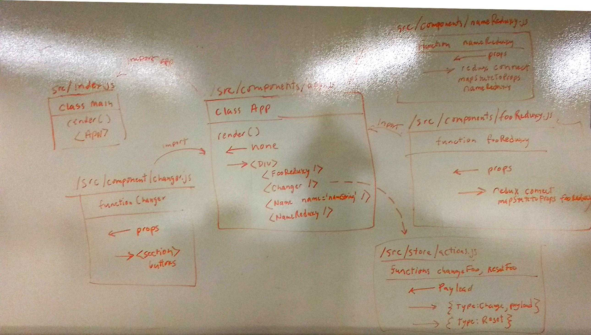
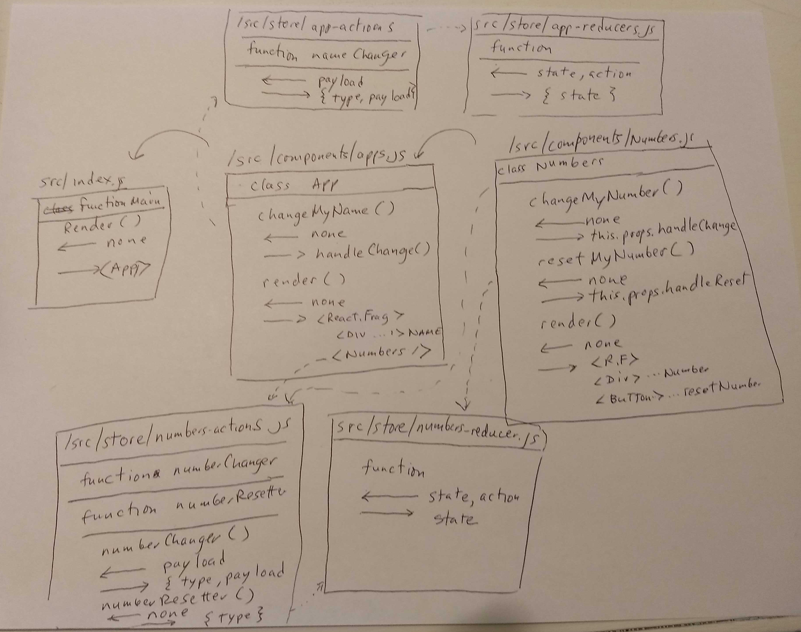

 LAB
=================================================

## Lab 31 Assignment 1 Connect to Store

### Author: Kevin O'Halloran

### Links and Resources
* [codesandbox for assignment 1](https://codesandbox.io/s/yq877nmj1x)

### Modules
#### `app.js`
App martials other components and renders the page for src/index.js.

##### Exported Values and Methods
The /src/components/app.js file exports the App class. 

#### `changer.js`
The src/components/changer.js component builds out Change and Reset buttons for the fooReduxy component. 

##### Exported Values and Methods
It exports a react-redux connect function call for both mapStateToProps and mapDispatchToProps methods for the Changer class. These allow the class to pull state from the redux store.

#### `fooReduxy.js`
The /src/components/fooReduxy functional component was created to replace the foo element on the page.

##### Exported Values and Methods
It exports a react-redux connect function call for the mapStateToProps method for the fooReduxy function. This allows the function to pull state from the redux store.

#### `name.js`
The /src/components/name component is an implementation of a non-redux component which gets props from its parent component, app.js.

##### Exported Values and Methods
The Name functional component exports itself. App.js passes 

#### `nameReduxy.js`
The /src/components/nameReduxy component was created to manage names via the redux store rather than the regular react parent-child architecture.

##### Exported Values and Methods
This functional component exports a react-redux connect function call for the mapStateToProps method for the function. This allows the function to pull state from the redux store.

#### `actions.js`
The /src/store/actions.js defines the actions that will be taken when the redux store manages state changes for foo.

##### Exported Values and Methods
This exports changeFoo and resetFoo. changeFoo takes a payload for input. This will be the value that foo is expected to change to. resetFoo does not take a payload, since reset will always change foo back to the initalState.

#### `index.js`
The /src/store/index.js is the main file for the redux store. It combines all individual reducers to manage state. (Usually this file defines a "reducers" object, but I have named this "state" to be more clear about what it is doing.)

##### Exported Values and Methods
This exports the createStore method for the combined reducers.

#### `person-reducer.js`
The /src/store/person-reducer defines initial state for person name.

##### Exported Values and Methods
It exports a function that takes state and action as inputs, parses out the action into type and payload variables, and uses that information to define what will happen when a person's name is going to change or be reset.

#### `reducers.js`
The /src/store/reducers.js file defines initial state for foo.

##### Exported Values and Methods
It exports a function that takes state and action as inputs, parses out the action into type and payload variables, and uses that information to define what will happen when foo is going to change or be reset.

#### `index.js`
scr/index is the main file for rendering the application. 

#### UML

## Lab 31 Assignment 2 New Reducer
### Author: Kevin O'Halloran
In the instruction, John writes that "The twist is that this new reducer will also be able to respond to actions that the other component fires." You can see this in my implementation by clicking on either the number or the Name. If you click on the name, both the Name and the Number are updated with a new name. On the other hand, if you click on the Number, both Name and Number are updated with a random number.

### Links and Resources
* [codesandbox for assignment 2](https://codesandbox.io/s/n7onx9jj0j)

### Modules
#### `app.js`
App martials other components and renders the page for src/index.js.

##### Exported Values and Methods
The /src/components/app.js file exports the App class. 

####  `numbers.js`
This component exports the Numbers class, which renders the number and provides functions for changing (changeMyNumber) and resetting the number (resetMyNumber). These functions are wired to the Redux store via mapStateToProps and mapDispatchToProps.

##### Exported Values and Methods
The /src/components/numbers.js file exports the Numbers class and a connection to the redux store via mapStateToProps and mapDispatchToProps, and via the exported Numbers class.

####  `app-actions.js`
This actions js file is used for wiring up changes between APP and the redux state store.

##### Exported Values and Methods
The /src/store/app-actions.js file exports the nameChanger function, which takes a payload as input, and returns an action type ("CHANGE") and the payload.

####  `app-reducers.js`
This reducer manages state for APPs name property. 

##### Exported Values and Methods
The /src/store/app-reducers.js exports a function which takes state and action, and returns the proper value for the type of action requested. 

####  `index.js`
The main file for the redux store combines all reducers. In this case, it combines teh appReducer for the app, and the numberReducer for the numbers component.

##### Exported Values and Methods
The /src/store/index exportes the createStore function.

####  `numbers-actions.js`
This actions file is used for wiring up changes between the Numbers component and the redux state store.

##### Exported Values and Methods
The /src/store/numbers-actions.js file exports two changer functions: numberChanger, which takes a payload as its input, and numberResetter, which does not require input.

####  `numbers-reducer.js`
This file defines the types of state change that the Number component will manage, and what they return. 

##### Exported Values and Methods
The /src/store/numbers-reducer.js file exports a function that takes state and action as inputs, parses type and payload from the action, and returns the proper value for the type of action.

